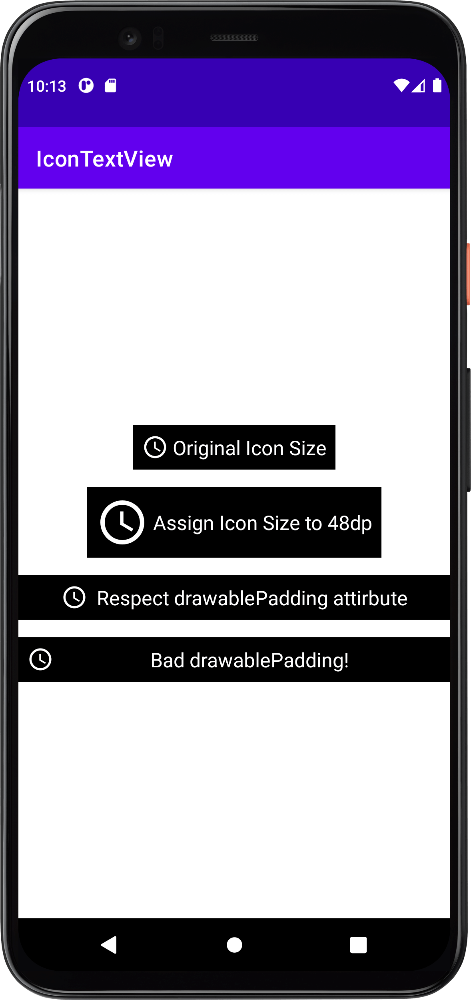

# IconTextView

Enhanced TextView to support set compound drawable size directly and respect drawablePadding attribute.

### Sample


### Sample Usage

```
<me.quenchjian.android.icontextview.IconTextView
    android:layout_width="wrap_content"
    android:layout_height="wrap_content"
    android:background="@color/black"
    android:drawablePadding="4dp"
    android:padding="8dp"
    android:text="Original Icon Size"
    android:textColor="@color/white"
    android:textSize="18sp"
    app:drawableStartCompat="@drawable/ic_baseline_access_time_24"
    app:drawableTint="@color/white"
    tools:ignore="HardcodedText" />

<me.quenchjian.android.icontextview.IconTextView
    android:layout_width="wrap_content"
    android:layout_height="wrap_content"
    android:layout_marginTop="16dp"
    android:background="@color/black"
    android:drawablePadding="4dp"
    android:gravity="center_vertical"
    android:padding="8dp"
    android:text="Assign Icon Size to 48dp"
    android:textColor="@color/white"
    android:textSize="18sp"
    app:drawableStartCompat="@drawable/ic_baseline_access_time_24"
    app:drawableTint="@color/white"
    app:iconSize="48dp"
    tools:ignore="HardcodedText" />

<me.quenchjian.android.icontextview.IconTextView
    android:layout_width="match_parent"
    android:layout_height="wrap_content"
    android:layout_marginTop="16dp"
    android:background="@color/black"
    android:drawablePadding="8dp"
    android:gravity="center"
    android:padding="8dp"
    android:text="Respect drawablePadding attirbute"
    android:textColor="@color/white"
    android:textSize="18sp"
    app:drawableStartCompat="@drawable/ic_baseline_access_time_24"
    app:drawableTint="@color/white"
    app:iconSize="24dp"
    tools:ignore="HardcodedText" />
```

### License
```
Copyright 2022 Quench Jian

Licensed under the Apache License, Version 2.0 (the "License");
you may not use this file except in compliance with the License.
You may obtain a copy of the License at

    http://www.apache.org/licenses/LICENSE-2.0

Unless required by applicable law or agreed to in writing, software
distributed under the License is distributed on an "AS IS" BASIS,
WITHOUT WARRANTIES OR CONDITIONS OF ANY KIND, either express or implied.
See the License for the specific language governing permissions and
limitations under the License.
```